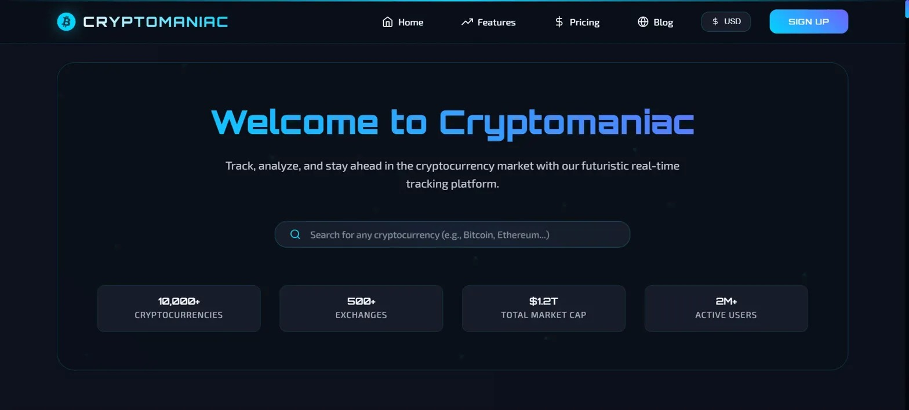
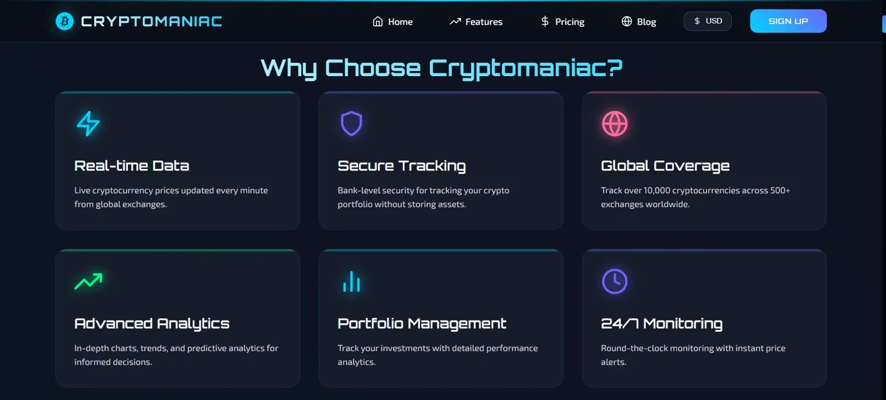
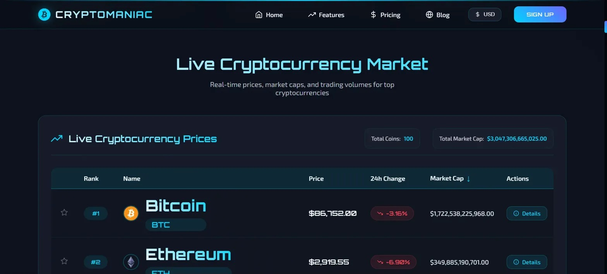
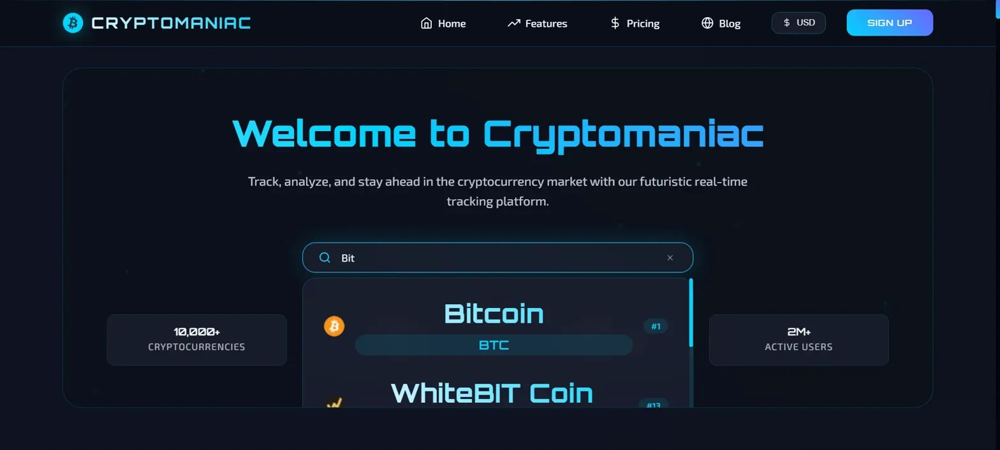

<div align="center">
  
  
  # Cryptomaniac
  
  ### Futuristic Cryptocurrency Price Tracker
  
  [](https://opensource.org/licenses/MIT)
  [](https://reactjs.org/)
  [](https://vitejs.dev/)
  [](./CONTRIBUTING.md)
  
  [Live Demo](#) | [Report Bug](https://github.com/SajidenOfnir/cryptomaniac/issues) | [Request Feature](https://github.com/SajidenOfnir/cryptomaniac/issues)
  
  <p align="center">
    Track, analyze, and stay ahead in the cryptocurrency market with our futuristic real-time tracking platform.
  </p>
</div>

---

## 📸 Screenshots

<details>
<summary>Click to expand screenshots</summary>

### 🏠 Home Page - Hero Section


*Welcome screen with search functionality and live market statistics*

### ✨ Features Section


*Six key features showcasing the platform's capabilities*

### 📊 Live Market Overview


*Real-time cryptocurrency prices with sorting and filtering*

### 🔍 Search Functionality


*Instant search with auto-suggestions*

### 💹 Detailed Coin Page


*Comprehensive coin analytics with interactive charts*

</details>

---

## ✨ Key Features

- 🎨 **Futuristic UI/UX** - Glassmorphism, neon colors, and smooth animations
- 📊 **Real-time Data** - Live cryptocurrency prices from 500+ exchanges
- 🔍 **Smart Search** - Instant search with intelligent suggestions
- 📈 **Interactive Charts** - Multiple timeframes (1D, 7D, 30D, 90D, 1Y)
- 💱 **Multi-Currency** - Support for USD, EUR, GBP, JPY, BDT
- 📱 **Fully Responsive** - Optimized for desktop, tablet, and mobile
- ⚡ **Lightning Fast** - Built with Vite for optimal performance
- 🎭 **Smooth Animations** - Powered by Framer Motion

---

## 🛠️ Tech Stack

| Category | Technologies |
|----------|-------------|
| **Frontend** | React 18, Vite 5 |
| **Routing** | React Router DOM v6 |
| **Styling** | Tailwind CSS, Custom CSS |
| **Charts** | Recharts |
| **Animations** | Framer Motion |
| **Icons** | React Icons |
| **HTTP** | Axios |
| **API** | CoinGecko API |

---

## 🚀 Getting Started

### Prerequisites

Before you begin, ensure you have the following installed:
- **Node.js** (v16 or higher)
- **npm** or **yarn**

### Installation

1. **Clone the repository**
```bash
   git clone https://github.com/SajidenOfnir/cryptomaniac.git
   cd cryptomaniac
```

2. **Install dependencies**
```bash
   npm install
   # or
   yarn install
```

3. **Create environment file**
```bash
   cp .env.example .env
```
   
   Edit `.env` and add your CoinGecko API key:
```env
   VITE_COINGECKO_API_KEY=your_coingecko_api_key
```

4. **Start development server**
```bash
   npm run dev
   # or
   yarn dev
```

5. **Open your browser**
   Navigate to `http://localhost:5173`

---

## 📦 Build for Production
```bash
npm run build
# or
yarn build
```

The optimized production build will be in the `dist/` directory.

---

## 🎯 Usage

### Searching for Cryptocurrencies
1. Use the search bar on the homepage
2. Type the name or symbol (e.g., "Bitcoin" or "BTC")
3. Click on any suggestion to view detailed information

### Viewing Coin Details
1. Click on any coin from the market overview table
2. View comprehensive analytics including:
   - Interactive price charts
   - Market statistics
   - All-time high/low
   - Supply information
   - Community links

### Changing Currency
1. Click the currency selector in the navbar
2. Choose from USD, EUR, GBP, JPY, or BDT
3. All prices update automatically

---

## 📂 Project Structure
```
src/
├── components/       # Reusable React components
├── context/          # React Context providers
├── hooks/            # Custom React hooks
├── pages/            # Page components
├── utils/            # Utility functions
└── App.jsx          # Main application component
```

---

## 🔑 Environment Variables

Create a `.env` file in the root directory:
```env
VITE_COINGECKO_API_KEY=your_coingecko_api_key
```

> **Note:** Never commit your `.env` file to version control.

---

## 🤝 Contributing

Contributions are what make the open-source community amazing! Any contributions you make are **greatly appreciated**.

Please read our [Contributing Guidelines](./CONTRIBUTING.md) before submitting a PR.

1. Fork the Project
2. Create your Feature Branch (`git checkout -b feature/AmazingFeature`)
3. Commit your Changes (`git commit -m 'Add some AmazingFeature'`)
4. Push to the Branch (`git push origin feature/AmazingFeature`)
5. Open a Pull Request

---

## 📝 License

This project is licensed under the MIT License - see the [LICENSE](./LICENSE) file for details.

---

## 🙏 Acknowledgments

- [CoinGecko](https://www.coingecko.com/) - Cryptocurrency data API
- [Recharts](https://recharts.org/) - Charting library
- [Framer Motion](https://www.framer.com/motion/) - Animation library
- [React Icons](https://react-icons.github.io/react-icons/) - Icon library
- [Tailwind CSS](https://tailwindcss.com/) - Utility-first CSS framework

---

## 📧 Contact

**Sajiden Ofnir** - [@SajidenOfnir](https://github.com/SajidenOfnir)

Project Link: [https://github.com/SajidenOfnir/cryptomaniac](https://github.com/SajidenOfnir/cryptomaniac)

---

## 🌟 Star History

[](https://star-history.com/#SajidenOfnir/cryptomaniac&Date)

---

<div align="center">
  Made with ❤️ by <a href="https://github.com/SajidenOfnir">SajidenOfnir</a>
  
  If you found this project helpful, please give it a ⭐!
</div>

